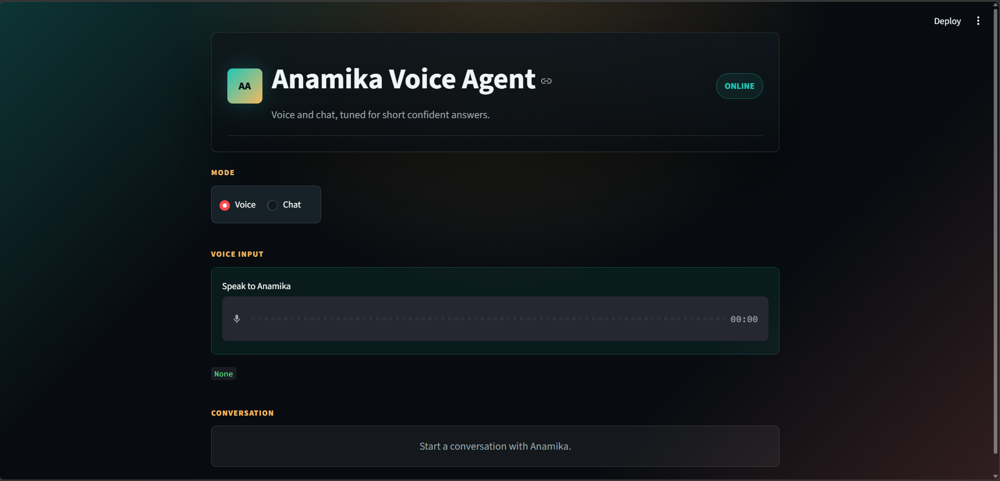

# Anamika Voice Agent

An impressive Streamlit-based AI voice and chat agent that answers as Anamika, using a personal RAG knowledge base, 100x company context, short-term conversation memory, voice input, and audio responses.

## Submission Screenshot





## Project Overview

This project is a personalized interview-style voice agent built with OpenAI, LangChain, FAISS, and Streamlit. The assistant responds in first person as Anamika and can answer questions about her background, skills, projects, career goals, and 100x-related context.

The app supports both text chat and voice conversation. Voice input is transcribed, processed through the RAG-powered backend, and converted back into speech for a complete conversational experience.

## Key Features

- Voice input using Streamlit audio recording
- Speech-to-text transcription with OpenAI Whisper
- Text-to-speech response generation with OpenAI TTS
- RAG-based answers from profile and company PDFs
- FAISS vector search for fast document retrieval
- Smart query routing between personal context, 100x context, and web search
- Optional Tavily search for current or market-related questions
- Short-term chat memory for more natural follow-up responses
- Clean Streamlit UI with chat bubbles, mode switching, and audio playback

## Tech Stack

- Python
- Streamlit
- OpenAI API
- LangChain
- LangGraph
- FAISS
- PyPDF
- Tavily Search
- python-dotenv

## Folder Structure

```text
assignment_chatbot_100x/
|-- backend.py
|-- app.py
|-- main.py
|-- requirements.txt
|-- .env.example
|-- data/
|   |-- Anamika_Profile_RAG.pdf
|   `-- 100x_profile.pdf
`-- screenshots/
    `-- submission-screenshot.png
```

## How It Works

1. The user chooses either Voice or Chat mode in the Streamlit app.
2. In Voice mode, the recorded audio is transcribed using OpenAI Whisper.
3. The backend checks whether the query is about Anamika, 100x, or a current topic.
4. Relevant documents are retrieved from FAISS vector stores created from the PDFs.
5. The LLM generates a short, confident, in-character response.
6. The answer is shown in the chat interface and converted into audio.

## Setup Instructions

### 1. Clone or Open the Project

Open the project folder:

```bash
cd assignment_chatbot_100x
```

### 2. Create a Virtual Environment

```bash
python -m venv myvnv
```

Activate it on Windows:

```bash
myvnv\Scripts\activate
```

### 3. Install Dependencies

```bash
pip install -r requirements.txt
```

### 4. Add Environment Variables

Copy `.env.example` to `.env` and add your keys:

```env
OPENAI_API_KEY=your_openai_api_key_here
TAVILY_API_KEY=your_tavily_api_key_here
```

`TAVILY_API_KEY` is required only for web-search-related questions.

### 5. Run the Application

```bash
streamlit run app.py
```

The app will open in the browser, usually at:

```text
http://localhost:8501
```

## Usage

- Select `Chat` to type questions directly.
- Select `Voice` to speak to the agent.
- Ask about Anamika's background, skills, education, projects, experience, or 100x.
- For latest trends or market-related questions, the app can use web search when configured.

## Example Questions

- Tell me about yourself.
- What are your strongest AI/ML skills?
- What projects have you built?
- Why are you interested in 100x?
- What makes you a good fit for this role?
- What are the latest trends in Generative AI?

## Highlights

This project demonstrates a complete AI application workflow: document-based retrieval, LLM response generation, agent routing, voice transcription, speech synthesis, memory, and frontend integration. It is designed as a polished assignment submission with both practical functionality and a professional user experience.

## Author

**Anamika**

Final-year M.Sc. student at IIT (ISM) Dhanbad, specializing in AI/ML and Generative AI.
